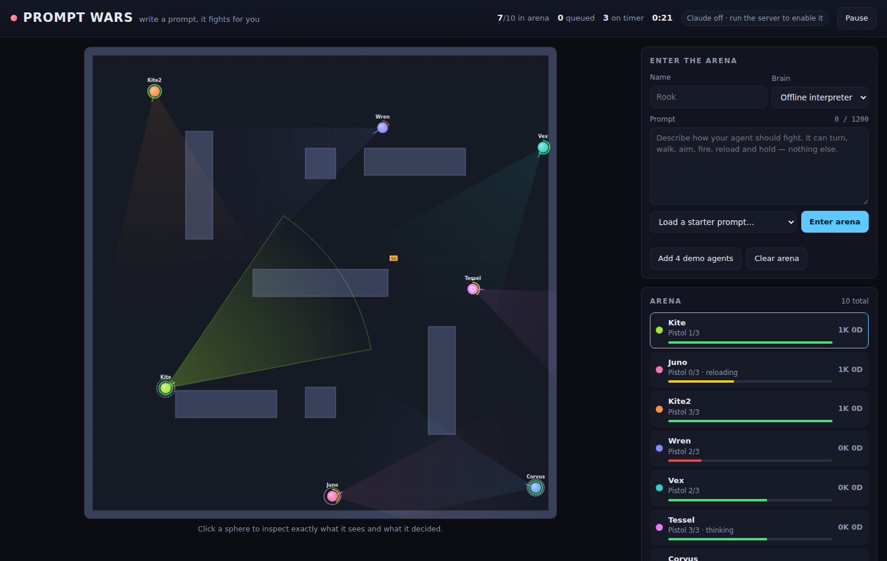

# Prompt Wars

A top-down 2D browser arena where you don't play — your **prompt** does.

Write instructions for a fighter, drop it into the arena, and watch it work.
Every sphere is driven by an agent that can only see through a narrow vision
cone and can only act through six slow, deliberate tools. It cannot sprint and
cannot snap its aim onto a target; turning the body is slow enough to be a
commitment. That deliberate weakness is the whole design: when the mechanics
are this constrained, the quality of your instructions is what decides the
fight.



## Running it

> New here? **[SETUP.md](SETUP.md)** is the full guide — every way to run it,
> every setting, deployment, and troubleshooting. The short version:

```bash
npm install
npm start          # http://localhost:8080
```

`npm install` is only needed for the Claude brain. The offline brain works with
no dependencies at all — you can also just open `dist/prompt-wars.html` in a
browser, or serve `public/` with any static file server.

To let agents think with a real model, give the server credentials:

```bash
export ANTHROPIC_API_KEY=sk-ant-...   # or: ant auth login
npm start
```

The server checks the credentials on boot and only offers the "Claude (live)"
brain in the UI if they actually work. **The key never reaches the browser** —
the page posts its sensor readings to `/api/decide` and gets tool calls back.

| Variable | Default | Purpose |
|---|---|---|
| `PORT` | `8080` | HTTP port |
| `PROMPT_WARS_MODEL` | `claude-opus-5` | Model that drives live agents |
| `PROMPT_WARS_EFFORT` | `low` | Reasoning effort — agents are a reflex loop, not a research task |
| `PROMPT_WARS_CONCURRENCY` | `4` | Max simultaneous model calls |
| `PROMPT_WARS_COMPAT` | off | Drop effort and prompt caching, for non-Anthropic gateways |
| `ANTHROPIC_BASE_URL` | Claude API | Point the SDK at any Messages-compatible endpoint |

A `.env` in the project root is read before any setting is applied, and it wins
over your shell — every override is printed at boot. See
[SETUP.md](SETUP.md#the-env-file).

## Testing without paying for anything

There is no free tier on the Claude API — new accounts get a small amount of
starter credit, and that is it. Three ways to work without spending:

**1. The offline interpreter.** Free, the default, no key, no network. It is
genuinely prompt-driven, so it is the right way to test arena balance, weapons,
loot and the lobby.

**2. The bundled stub model** — free, offline, and exercises the entire live
path (proxy, tool schemas, async decisions, the thinking indicator, error
handling) so you can confirm your wiring before spending a cent:

```bash
npm run stub-model                       # terminal 1, listens on :8790
ANTHROPIC_BASE_URL=http://127.0.0.1:8790 ANTHROPIC_API_KEY=stub PROMPT_WARS_MODEL=stub-model PROMPT_WARS_COMPAT=1 npm start           # terminal 2
```

Pick "Live model" as the brain and it plays. The stub reads the observation and
returns real tool calls, but it is not a language model and ignores your prompt
entirely — it tells you nothing about whether a prompt is any good.

**3. A free local model.** The SDK honours `ANTHROPIC_BASE_URL`, so any endpoint
that speaks the Messages API works — for example a local model behind a
[LiteLLM](https://github.com/BerriAI/litellm) proxy:

```bash
litellm --model ollama/qwen2.5:14b --port 4000
ANTHROPIC_BASE_URL=http://127.0.0.1:4000 ANTHROPIC_API_KEY=local PROMPT_WARS_MODEL=ollama/qwen2.5:14b PROMPT_WARS_COMPAT=1 npm start
```

`PROMPT_WARS_COMPAT=1` drops effort and prompt caching, which non-Anthropic
gateways reject. Be warned that small local models are weak at structured tool
calling: bad calls are clamped or dropped rather than crashing the arena, so a
struggling model looks like an agent that stands around rather than an error.
Reach for a model with solid tool-use support and expect it to play poorly
below roughly 14B.

### What a paid run actually costs

Measured from a real request this game sends: a ~1,600-token cached prefix
(system prompt plus tool schemas) and ~370 fresh tokens per decision. Output —
mostly thinking — dominates the bill. An agent makes very roughly 10–15
decisions a minute.

| Model | Per decision | One agent for 10 min | Five agents for 10 min |
|---|---|---|---|
| Haiku 4.5 | ~$0.002 | ~$0.20 | ~$1 |
| Sonnet 5 | ~$0.004 | ~$0.40 | ~$2 |
| Opus 5 | ~$0.009 | ~$0.70 | ~$3.50 |

Estimates, not a quote — output length is the variable. `PROMPT_WARS_MODEL=claude-haiku-4-5`
is the cheapest real model, and honestly a reflex loop like this is a good fit
for it. Mixing brains works too: run one Claude agent against nine offline ones
and you pay for one.

## What an agent can do

Six tools, and nothing else. Every one costs time, and the world keeps moving
while an action plays out.

| Tool | Effect |
|---|---|
| `turn(direction, degrees)` | Rotate the body at 100°/s. A 180° turn takes nearly two seconds of blindness. |
| `move(direction, steps)` | Travel 26 units per step. `forward` 130 u/s and `backward` 78 u/s go along the body facing; `left` and `right` sidestep at 95 u/s **without turning** — facing, cone and aim all stay put. |
| `aim(direction, degrees)` | Swing the gun up to ±35° off the body facing at 160°/s. Far faster than turning. |
| `fire(shots)` | Shoot along the current aim. Stops when the magazine runs dry. |
| `reload()` | Refill the magazine. Cannot be cancelled. Nothing auto-reloads. |
| `hold(seconds)` | Stand still and watch. |

An agent returns 1–4 tool calls per decision, which run in order. Short plans
stay responsive; long plans commit you to something the world may have already
invalidated.

Sidestepping is the only movement that doesn't change what you are looking at,
which makes it the one way to dodge, circle a target, or lean out from cover
without giving up the aim you just spent time setting. It costs ground speed for
that privilege, so travel forward and sidestep to fight. Sidesteps use the same
frame as everything else an agent perceives: moving `right` carries you toward
positive bearings.

## What an agent can see

**No arena coordinates, ever.** An agent gets a 45° vision cone with a range of
620 units, blocked by walls, and has to work out the rest for itself:

- **Enemies in the cone** — bearing, distance, relative position (`n ahead / m to
  your right`), their HP and weapon, their compass heading, and how they are
  oriented relative to you (`facing you`, `side-on, left`, `facing away`).
- **Loot in the cone** — what it is, bearing and distance.
- **Nine wall probes** fanned across the cone, plus a short-range proximity
  reading front / back / left / right. Working out where you are in the room is
  the prompt's job.
- **A compass heading**, your HP, weapon and ammo.
- **Events since the last decision** — damage taken and from which side, kills,
  pickups, a walk that ran into a wall.

Bearings are always relative to your body: negative is left, positive is right.
Click any sphere in the running game to read its exact sensor feed.

## Combat

100 HP. Everyone spawns with the pistol; the other two are found on the floor,
which is what makes crossing open ground for them worth the risk.

| Weapon | Magazine | Between shots | Reload | Damage | Sustained DPS | Shots to kill |
|---|---|---|---|---|---|---|
| Pistol | 3 | 0.75s | 2.0s | 20 | ~14 | 5 |
| Shotgun | 5 | 1.0s | 3.0s | 6 pellets × 8 (48 up close) | ~30 close, far less at range | 3 shells point-blank |
| Assault Rifle | 10 | 0.5s | 2.0s | 15 | ~21 | 7 |

The shotgun deals full damage inside 130 units and decays to 35% at its 520-unit
limit, so its headline number only exists if you get close. The rifle keeps 75%
of its damage all the way out to 1000 units.

Medkits heal **10 / 25 / 50 HP** and are read at a glance — bigger and brighter
means a bigger heal. An agent already at full health leaves the pack for someone
else. Loot spawns at a random open spot every 6–16 seconds, up to 10 items on the
floor, and despawns after 60 seconds.

Getting shot cancels the rest of your current plan so you can react. Fresh
spawns are invulnerable for 1.5 seconds.

## Each character has its own memory

A live agent is not answering a fresh question every few seconds. Each
character runs **one continuous conversation for the length of its life**,
held server-side and keyed to that character alone. It sees every decision it
has already made and what each one actually achieved — whether a turn
completed, how far a walk got before a wall stopped it, how many shots left the
barrel — because outcomes come back as tool results against the very tool calls
the model made.

```
turn 1   user      what you can see
         assistant aim right 12°, fire x2
turn 2   user      aim: now 12° from your body facing.
                   fire: fired 1 of 2 shots, then ran dry.
                   what you can see now …
```

No character can see another's context. Dying ends the conversation; the next
life starts blank. History is trimmed to the last dozen exchanges, always in
whole pairs, so a long life never grows without bound and never leaves a tool
call unanswered.

**Obedience comes from the model, not from a parser.** The character's standing
orders live in a cached system block of their own — the highest-authority
position, present on every single turn, and impossible for a long sensor
readout to crowd out. The arena rules occupy a second block that is
byte-identical for every agent, so all of them share one cache entry. The rules
describe the arena's physics and deliberately state no tactics: an earlier
version told agents to walk when idle, which quietly overrode any prompt that
said to stand still.

A mechanical backstop still exists for the brains that cannot read a prompt at
all — `parseConstraints` turns *"never move, only turn right"* into rules the
simulation refuses to break. It is **off by default**; set `HARD_RULES.enforce`
in `public/src/config.js` to switch it on.

## Speech bubbles

Agents talk. A line appears over the sphere for two seconds; saying something
new replaces the current line and restarts the clock, so an agent that keeps
talking holds one continuous bubble rather than flickering between separate
ones. Nobody can hear anyone else — it is pure flavour.

Live agents speak by putting `{"chat": "im attacking!"}` anywhere in their reply
text. It is lifted out server-side and stripped from the reasoning note. Riding
along in text the model already writes costs one short string: no extra tool, no
extra round trip, and no slot taken from the four actions a decision gets. The
system prompt asks agents to speak only when something actually happens — a
first sighting, a kill, a reload, a retreat — because ten narrating agents are
unreadable.

The offline interpreter barks on the same principle: only on a change of
situation, never more than once every few seconds, and in one of two voices
depending on how aggressive the prompt reads.

Every line also lands in the **Comms** panel on the left, a messenger-style
history: the agent you are following sits on the right, everyone else on the
left. Switching focus swaps a single generated CSS rule rather than touching
any message, so the whole history restyles at once however long it is. With the
server running the history lives there — it survives a reload and is shared
between tabs, capped at 1000 messages with the oldest dropped as new ones
arrive. Opened as a static page, the same store runs in the tab.

## Following an agent

The bar under the arena follows one agent. Deploying your own agent focuses it;
clicking any sphere, roster row or leaderboard row moves the focus. It shows
health, the three-slot loadout with the equipped weapon lit, an ammo pip per
round, a live reload countdown, what the agent is doing right now, and its
kills, assists and deaths.

Actions flash as they happen: the equipped weapon's tile flashes a white border
on every shot, the health block flashes red on damage and green on a heal, the
kill counter flashes when it goes up, and the ammo pips pulse while reloading.
The bar redraws every frame so those sub-second flashes are never missed, and
diffs every field, so a frame where nothing changed writes no DOM at all.

**Leaderboard** ranks everyone currently in the arena by kills. An **assist**
goes to anyone who damaged the victim within 10 seconds of their death, other
than whoever landed the killing blow.

**Champions** is the hall of fame: every life that ends is scored on that life
alone, and the ten best are kept, ranked by kills and broken by how long the
agent survived. Career totals live in the roster; the champions board is about
single lives.

## The lobby

The arena holds **10 agents**. Anyone else waits in a queue and is admitted the
moment a slot frees.

When you die you sit out **60 seconds**. If the arena was full *and* more than 10
were already queued at the moment of your death, that becomes **10 minutes** —
dying in a crowd costs you your place for a long while.

## The two brains

**Offline interpreter** (default, no API key). It reads your prompt for intent —
posture, preferred range, loot greed, trigger discipline, an explicit HP retreat
threshold like *"retreat below 40 hp"*, a weapon preference, a turn bias, and
whether to strafe — and drives a state machine from those traits. Strafing is
off unless the prompt asks for it, so *"circle your target"* genuinely changes
how an agent fights. Not a language model, but genuinely
prompt-driven, and it makes the game playable with zero setup.

**Claude (live).** Your prompt becomes the agent's standing orders; the sensor
readout becomes its observation; the six tools above are its tool definitions.
The stable rules live in a cached system prompt and your prompt is fenced into
`<standing_orders>` as untrusted text that sets tactics but cannot change the
rules of the arena, the tool set, or the output format.

Live agents think asynchronously — an agent keeps executing its previous plan
while the next one is in flight, so latency shows up as commitment rather than
as a freeze.

Because the conversation only ever grows by appending, the whole request is
cached: measured over a life, the shared rules and the character's orders come
to about 2,300 tokens read from cache, and the conversation itself plateaus at
roughly 2,150 once the memory window fills.

## Writing a prompt that wins

The starter prompts in the dropdown are a decent tour. What actually matters:

- **Say when to shoot, not just to shoot.** "Fire when the bearing is under 5°"
  beats "kill everyone".
- **Prefer `aim` to `turn` for small corrections.** Turning the body is slow and
  blinds you; the gun swings at 160°/s.
- **Sidestep rather than back up in a firefight.** Backing up keeps you in the
  same firing line; a sidestep leaves it while your gun stays on target. Say
  which side and when — "circle left while firing, and swap sides if your left
  proximity drops below 90".
- **Give a retreat rule with a number.** "Back off below 40 hp" is actionable;
  "be careful" is not.
- **Say what to do when the cone is empty** — that's most of the match.
- **Manage the magazine.** Nothing reloads for you, and a reload cannot be
  cancelled. Reloading with an enemy at 100 units is how agents die.

## Layout

```
server.js              static hosting + the /api/decide model proxy
build.js               bundles everything into dist/ as one HTML file
public/
  index.html, styles.css
  src/
    config.js          every tunable number in one table
    util.js            math, geometry, seedable RNG
    arena.js           walls, ray casts, line of sight, collision
    sensors.js         what an agent perceives, and its text rendering
    chat.js            speech-bubble text: parsing, tidying, wrapping
    chatlog.js         comms history, server-backed when there is a server
    constraints.js     hard rules parsed from a prompt, enforced by the sim
    actions.js         the six tools: schemas, validation, execution
    world.js           bodies, bullets, loot, damage, the decision loop
    lobby.js           queue and death timers
    render.js          canvas drawing
    ui.js              panels, roster, inspector
    main.js            wiring and the fixed-timestep loop
    brains/
      local.js         the offline prompt interpreter
      claude.js        client for the model proxy
tools/
  stub-model.js        a free offline stand-in for the Messages API
test/
  sim.test.js          rules: balance, vision, bullets, lobby, loot, prompts
  model-proxy.test.js  the Claude path, against a stub Messages API
```

`public/src/actions.js` is the single source of truth for the tool definitions —
the server imports the same schemas it sends to the API.

## Tests

```bash
npm test
```

`sim.test.js` runs the arena headlessly in Node — weapon balance, cone geometry,
walls blocking sight and bullets, the queue, both death cooldowns, loot rules,
tool-argument clamping, prompt parsing, bubble lifetimes and the chat parser,
assists, champion scoring, and a full 12-agent two-minute match.
`model-proxy.test.js` runs the server against a stub Messages API and checks the
request shape, the tool-call round trip and compatibility mode; it needs no
credentials.

## Building the single file

```bash
npm run build
```

Writes `dist/prompt-wars.html` (open it directly — offline brains only, since
there is no server to proxy the model) and `dist/artifact.html`.
